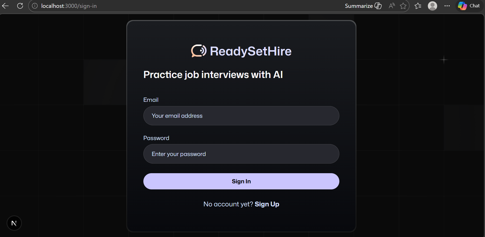
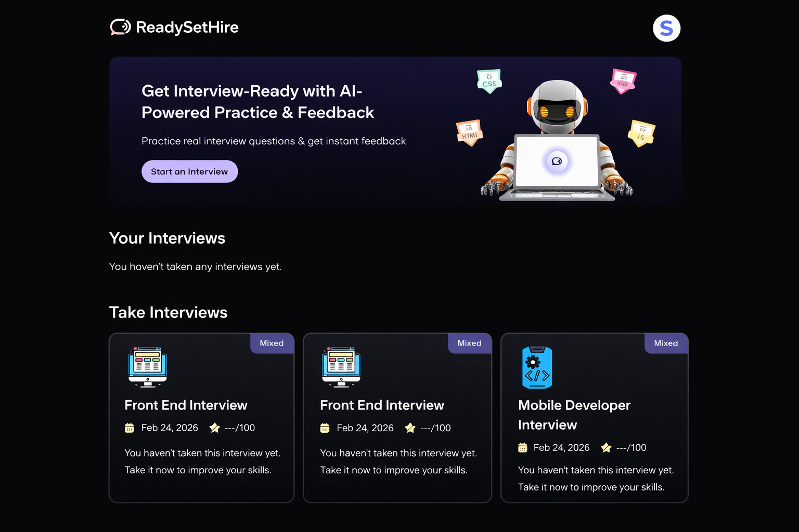
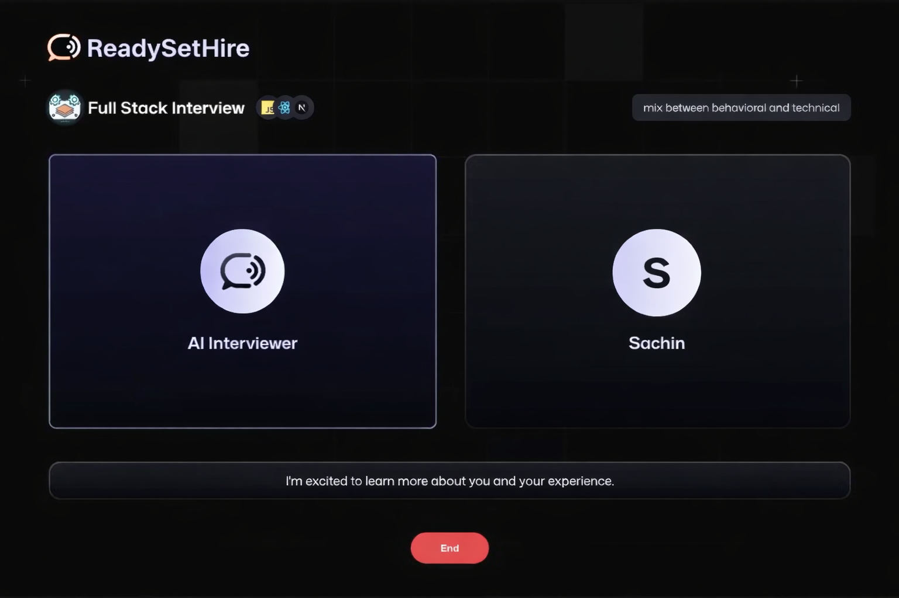
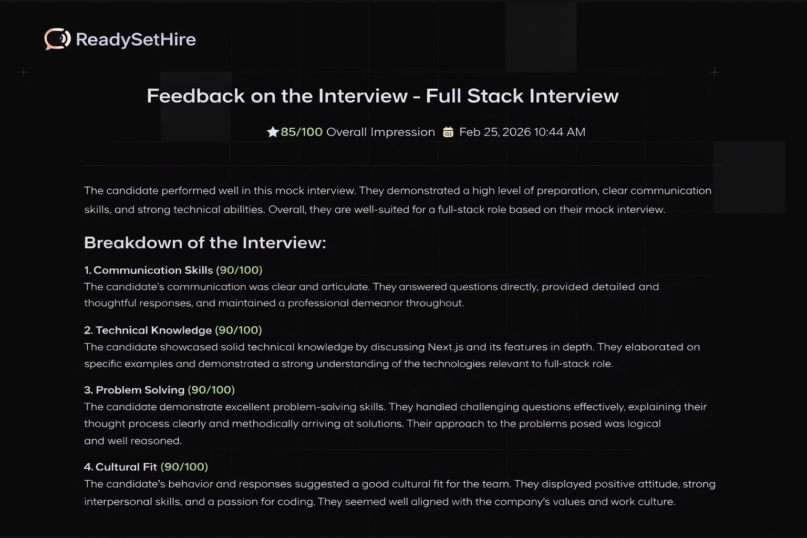
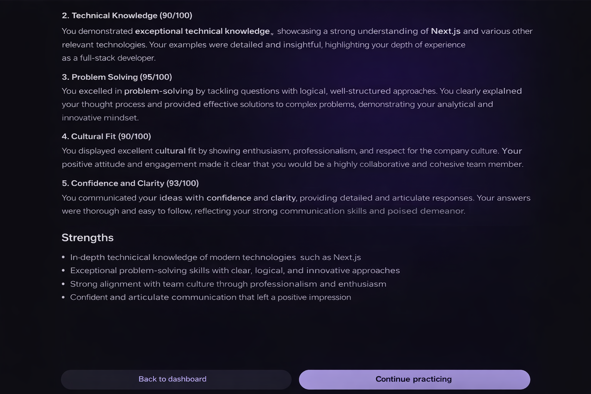

<div align="center">
   <h3 align="center">ReadySetHire: A job interview preparation platform.</h3>
</div>


## <a name="introduction">🤖 Introduction</a>

ReadySetHire is a full-stack AI mock interview platform built with Next.js for both frontend and backend logic, Firebase for authentication and real-time data management and modern UI. The platform integrates Vapi’s voice agents to simulate realistic, interactive interview experiences.

Designed to demonstrate practical AI integration in modern web applications,ReadySetHire allows users to practice job interviews in a dynamic environment while showcasing scalable architecture, authentication flows, and AI-driven interaction. This project highlights my ability to build production-ready applications that combine intuitive user experience with intelligent backend systems.


## <a name="tech-stack">⚙️ Tech Stack</a>

- Next.js
- Firebase
- Tailwind CSS
- Vapi AI
- Google Gemini
- Zod

## <a name="features">🔋 Features</a>

👉 **Authentication**: Sign Up and Sign In using password/email authentication handled by Firebase.

👉 **Create Interviews**: Easily generate job interviews with help of Vapi voice assistants and Google Gemini.

👉 **Get feedback from AI**: Take the interview with AI voice agent, and receive instant feedback based on your conversation.

👉 **Modern UI/UX**: A sleek and user-friendly interface designed for a great experience.

👉 **Interview Page**: Conduct AI-driven interviews with real-time feedback and detailed transcripts.

👉 **Dashboard**: Manage and track all your interviews with easy navigation.

👉 **Responsiveness**: Fully responsive design that works seamlessly across devices.

and many more, including code architecture and reusability

## 📸 Screenshots

### 🏠 Login Page


### 📊 Dashboard


### 🎤 Interview Session


### 📈 AI Feedback



## 🏗️ Architecture Overview

- Next.js handles frontend and API routes
- Firebase manages authentication and database
- Vapi handles voice-based interview conversations
- Google Gemini generates interview questions and AI feedback
- Zod validates form inputs and request data

## 🧠 AI Workflow

1. User selects job role
2. Google Gemini generates tailored interview questions
3. Vapi voice agent conducts the interview
4. Conversation transcript is analyzed
5. AI generates structured feedback
6. Results are stored in Firebase


## <a name="Project-Setup">🤸 Project Setup</a>

Follow these steps to set up the project locally on your machine.

**Prerequisites**

- [Git](https://git-scm.com/)
- [Node.js](https://nodejs.org/en)
- [npm](https://www.npmjs.com/) (Node Package Manager)

**Cloning the Repository**

```bash
git clone https://github.com/Shreyash-Pathare/ReadySetHire.git
cd ReadySetHire
```

**Installation**

Install the project dependencies using npm:

```bash
npm install
```

**Set Up Environment Variables**

Create a new file named `.env.local` in the root of your project and add the following content:

```env
NEXT_PUBLIC_VAPI_WEB_TOKEN=
NEXT_PUBLIC_VAPI_WORKFLOW_ID=

GOOGLE_GENERATIVE_AI_API_KEY=

NEXT_PUBLIC_BASE_URL=

NEXT_PUBLIC_FIREBASE_API_KEY=
NEXT_PUBLIC_FIREBASE_AUTH_DOMAIN=
NEXT_PUBLIC_FIREBASE_PROJECT_ID=
NEXT_PUBLIC_FIREBASE_STORAGE_BUCKET=
NEXT_PUBLIC_FIREBASE_MESSAGING_SENDER_ID=
NEXT_PUBLIC_FIREBASE_APP_ID=

FIREBASE_PROJECT_ID=
FIREBASE_CLIENT_EMAIL=
FIREBASE_PRIVATE_KEY=
```

Replace the placeholder values with your actual **[Firebase](https://firebase.google.com/)**, **[Vapi](https://vapi.ai/?utm_source=youtube&utm_medium=video&utm_campaign=jsmastery_recruitingpractice&utm_content=paid_partner&utm_term=recruitingpractice)** credentials.

**Running the Project**

```bash
npm run dev
```

Open [http://localhost:3000](http://localhost:3000) in your browser to view the project.

## 🚧 Challenges & Learnings

- Implementing real-time voice interaction with Vapi
- Handling secure Firebase authentication
- Managing environment variables safely
- Structuring scalable API routes in Next.js

## 🔮 Future Improvements

- Improve AI feedback scoring system
- Enable video-based mock interviews

